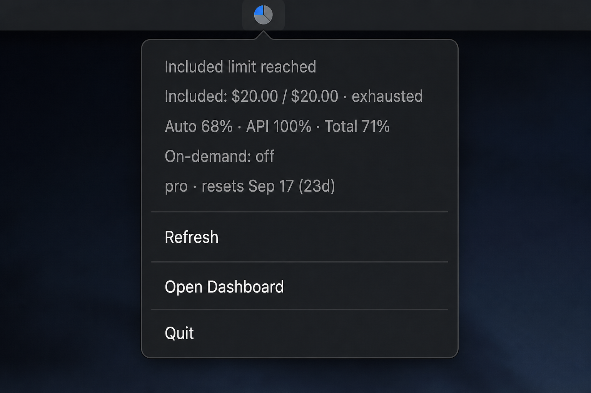

<p align="center">
  
</p>

<h1 align="center">CursorUsageBar</h1>

<p align="center">
  Uso del plan Cursor en la barra de menús de macOS — dólares incluidos, % de pools, credits y slow pool.
</p>

<p align="center">
  <a href="README.md">English</a> ·
  <a href="README.ko.md">한국어</a> ·
  <a href="README.ja.md">日本語</a> ·
  <a href="README.zh-CN.md">简体中文</a> ·
  <a href="README.es.md"><b>Español</b></a> ·
  <a href="README.fr.md">Français</a> ·
  <a href="README.de.md">Deutsch</a>
</p>

<p align="center">
  
</p>

<p align="center">
  
</p>

<p align="center">
  <code>./install.sh</code> — compila, instala en <code>~/Applications</code> y abre. Sin API key ni Keychain.
</p>

---

## Instalación

```bash
git clone https://github.com/vzts/cursor-usage-bar.git
cd cursor-usage-bar
./install.sh
```

**Requisitos:** macOS 14+, Xcode CLT / Swift 5.9+, Cursor IDE iniciado al menos una vez en este Mac.

## Qué muestra

| Elemento | Significado |
| --- | --- |
| Anillo / tooltip | % total · included `$usado/$límite` · Slow pool si activo |
| Titular | “Included limit reached” si los $ se agotaron; si no, mensaje % de Cursor |
| Included | **$ usado / $ límite** del plan — señal fiable de agotamiento |
| Pools | % Auto · API · Total |
| On-demand | Pago por uso, si está activo |
| Credits | Créditos promo, si hay |
| Slow pool | Cola lenta solo Auto, si está activa |
| Meta | Plan · reinicio del ciclo |

El % de la app puede retrasarse o no coincidir con los dólares; se muestran ambos.

### Actualización

| Cuándo | Intervalo |
| --- | --- |
| Menú abierto en los últimos 5 min | 1 min |
| Inactivo | 5 min |
| Abrir menú / **Refresh** (`r`) | inmediato |

## Cómo funciona

Lee `cursorAuth/accessToken` de `state.vscdb` local (solo lectura, sin Keychain) y consulta en paralelo:

- `GET https://cursor.com/api/usage-summary`
- `POST …/GetUsageLimitStatusAndActiveGrants`

API no oficial del panel — no es un producto oficial de Cursor.

## Desinstalar

```bash
killall CursorUsageBar 2>/dev/null || true
rm -rf ~/Applications/CursorUsageBar.app
```

## Licencia

MIT
