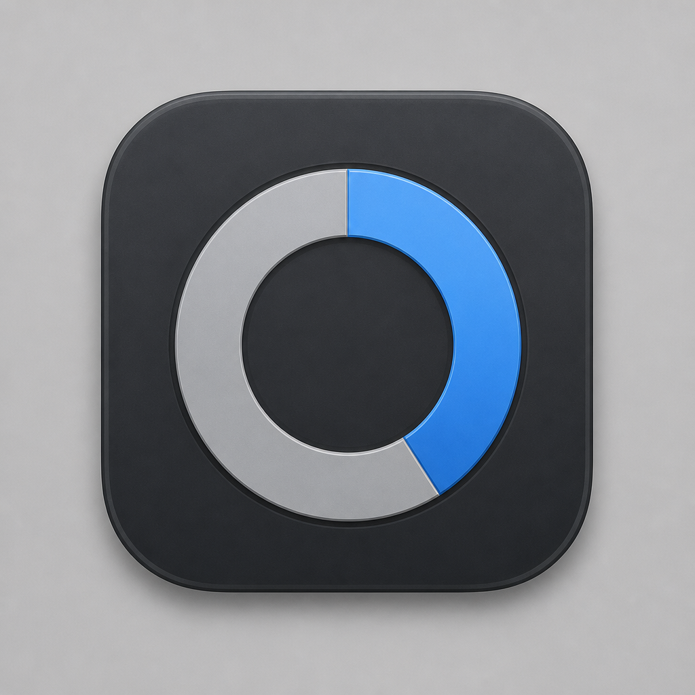
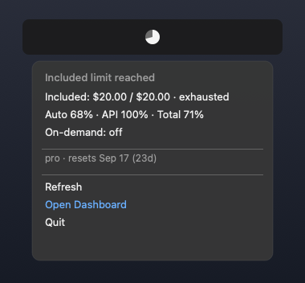

<p align="center">
  
</p>

<h1 align="center">CursorUsageBar</h1>

<p align="center">
  Cursor plan usage in the macOS menu bar — included dollars, pool %, credits, slow pool.
</p>

<p align="center">
  <a href="README.md"><b>English</b></a> ·
  <a href="README.ko.md">한국어</a> ·
  <a href="README.ja.md">日本語</a> ·
  <a href="README.zh-CN.md">简体中文</a> ·
  <a href="README.es.md">Español</a> ·
  <a href="README.fr.md">Français</a> ·
  <a href="README.de.md">Deutsch</a>
</p>

<p align="center">
  
</p>

<p align="center">
  <code>./install.sh</code> — build, install to <code>~/Applications</code>, launch. No API key. No Keychain prompt.
</p>

---

## Why

Cursor’s in-app **% can lag or disagree** with your real included **$ used/limit**. CursorUsageBar shows both in the menu bar so you can tell when included dollars are actually exhausted — and when credits or slow pool apply.

## Install

```bash
git clone https://github.com/vzts/cursor-usage-bar.git
cd cursor-usage-bar
./install.sh
```

Builds release, verifies WAL-safe session DB reads, installs `~/Applications/CursorUsageBar.app`, and launches it.

**Requirements:** macOS 14+, Xcode CLT / Swift 5.9+, Cursor IDE signed in once on this Mac (token in local `state.vscdb`; IDE need not stay open).

## What you see

| Item | Meaning |
| --- | --- |
| Menu bar pie / tooltip | Display total % · included `$used/$limit` · slow-pool hint when active |
| Headline | “Included limit reached” when $ exhausted; otherwise Cursor’s % message |
| Included | `$used / $limit` plus `· exhausted` or `· $X left` |
| Pools | Auto · API · Total display % |
| On-demand | `$used / $limit`, `$used used`, or `off` |
| Credits | `$remaining / $total · expiry` — hidden when no promo grants |
| Slow pool | Delay queue — Auto only or limited models · optional grant $ · ~delay — hidden when inactive |
| Meta | e.g. `pro · resets Sep 17 (23d)` |

### Menu actions

| Action | |
| --- | --- |
| **Refresh** (`r`) | Fetch latest usage |
| **Open Dashboard** (`o`) | [cursor.com/dashboard/spending](https://cursor.com/dashboard/spending) |
| **Quit** (`q`) | Exit the app |

### Refresh

| When | Interval |
| --- | --- |
| Menu opened in the last 5 min | 1 min |
| Idle | 5 min |
| Menu open / **Refresh** (`r`) | immediate |

## How it works

1. Reads `cursorAuth/accessToken` from  
   `~/Library/Application Support/Cursor/User/globalStorage/state.vscdb`  
   with `mode=ro&immutable=1` — **no Keychain prompt**
2. Derives the dashboard session cookie from the JWT `sub`
3. In **parallel**:
   - `GET https://cursor.com/api/usage-summary` — included $, pool %, on-demand, plan/cycle
   - `POST https://api2.cursor.sh/aiserver.v1.DashboardService/GetUsageLimitStatusAndActiveGrants` — promo credits + slow pool
4. Credits / slow pool are **best-effort**: primary usage still shows if the grants RPC fails

Undocumented dashboard APIs — **not an official Cursor product**. Token is read fresh each refresh and never written back.

## Privacy

The repo contains no Cursor token, email, or machine paths. At runtime the app only reads the local Cursor session on **your** Mac.

## Uninstall

```bash
killall CursorUsageBar 2>/dev/null || true
rm -rf ~/Applications/CursorUsageBar.app
# Remove from Login Items if you added it
```

## License

MIT
